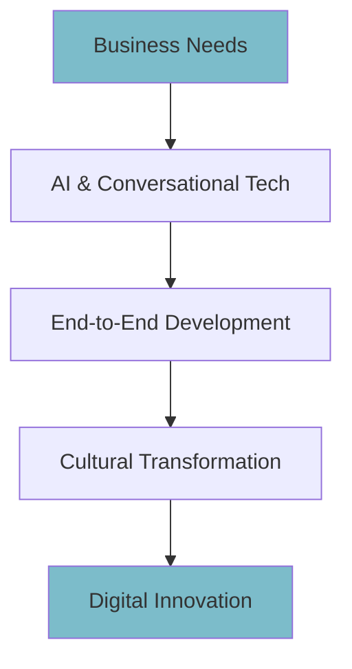

## Overview

Vidiemme builds intelligent digital solutions by integrating AI, conversational technologies, end-to-end development, and cultural transformation. You gain access to customized AI-driven apps, chatbots, web platforms, and mobile solutions tailored for industries like Retail, Fashion, Pharma, and Finance. This framework ensures your business anticipates emerging technologies and transforms processes efficiently.



## Core Concepts

Discover the foundational elements through these key areas.

<Columns cols={3}>
  <Card title="AI Integration" icon="zap" href="#">
    Embed machine learning models for predictive analytics and automation.
  </Card>
  <Card title="Conversational Tech" icon="message-circle" href="#">
    Deploy chatbots and voice assistants for seamless user interactions.
  </Card>
  <Card title="End-to-End Solutions" icon="layers" href="#">
    Handle design, development, deployment, and maintenance in one flow.
  </Card>
</Columns>

## AI and Conversational Integration

Integrate AI models with conversational interfaces to create responsive systems. You start by selecting frameworks like TensorFlow for AI and Dialogflow for chatbots.

<CodeGroup tabs="JavaScript,Python">
  ```javascript
  // Integrate AI model with chatbot
  import { OpenAI } from 'openai';
  const openai = new OpenAI({ apiKey: 'YOUR_API_KEY' });

  async function generateResponse(userInput) {
    const completion = await openai.chat.completions.create({
      model: 'gpt-3.5-turbo',
      messages: [{ role: 'user', content: userInput }],
    });
    return completion.choices[0].message.content;
  }
  ```
  ```python
  # Python AI integration example
  import openai

  openai.api_key = 'YOUR_API_KEY'

  def generate_response(user_input):
      response = openai.ChatCompletion.create(
          model='gpt-3.5-turbo',
          messages=[{'role': 'user', 'content': user_input}]
      )
      return response.choices[0].message.content
  ```
</CodeGroup>

<Callout kind="tip">
  Replace `YOUR_API_KEY` with your secure key from the provider dashboard.
</Callout>

## End-to-End Solution Development

Follow these steps to build complete solutions from ideation to deployment.

<Steps>
  <Step title="Discovery" icon="search">
    Analyze your business requirements and map AI opportunities.
  </Step>
  <Step title="Design" icon="layout">
    Prototype conversational flows and AI models.
  </Step>
  <Step title="Develop" icon="code">
    Code and integrate components using modern stacks.
  </Step>
  <Step title="Deploy" icon="upload-cloud">
    Launch on cloud platforms with monitoring.
  </Step>
</Steps>

## Cultural Transformation Strategies

Adapt your organization to digital innovation using proven strategies. Choose approaches based on your maturity level.

<Tabs>
  <Tab title="Incremental Change" icon="trending-up">
    Gradually introduce AI tools to teams.

    | Phase | Action | Timeline |
    |-------|--------|----------|
    | 1     | Train staff | 1 month |
    | 2     | Pilot projects | 3 months |
    | 3     | Scale adoption | 6 months |
  </Tab>
  <Tab title="Transformative Shift" icon="zap">
    Overhaul processes with AI at the core.

    <Expandable title="Advanced Techniques">
      Use workshops to align teams on AI ethics and adoption metrics.
    </Expandable>
  </Tab>
</Tabs>

<Callout kind="info">
  Vidiemme's San Francisco presence connects you to global startups for cutting-edge insights since 2015.
</Callout>